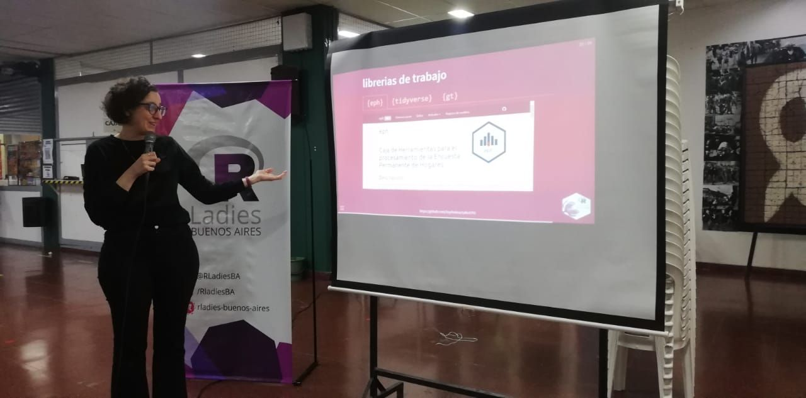

## Análisis elecciones 2015

{fig-align="center"}

Más de 100 participantes se sumaron el 7/09/2023 en el Taller de Introducción al análisis de la Encuesta Permanente de Hogares (EPH)

Junto a mi compañera del Núcleo de Innovación Social, Andrea Gómez y en representación de RLadies Buenos Aires, realizamos un taller para más de 100 estudiantes de la carrera de sociología de la Universidad de Buenos Aires.

El encuentro propuso una experiencia de programación hands on con tres paquetes del lenguaje de código abierto R: EPH, Tidyverse y GT con los que pudieron descargar directamente desde R las bases de EPH, realizar una serie de pasos de limpieza de datos y disponibilizarlos en una tabla en HTML.

Todo el material (incluyendo slides y ejercicios) está disponible en el micrositio del Taller https://eph-ubasociales.netlify.app/
