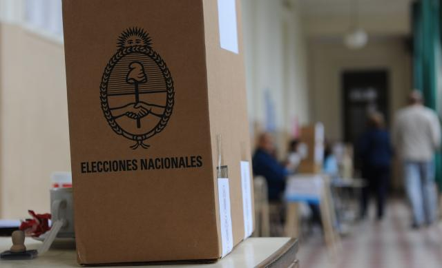

## Análisis elecciones 2015

{fig-align="center"}

Las elecciones 2015 significaron una ruptura en la historia de la joven democracia argentina: por primera vez fue elegido un presidente que no pertenecía ninguno de los partidos tradicionales argentinos (el peronismo y el radicalismo). En el marco de la materia Investigación Electoral y de Opinión Pública Aplicada de la Maestría en Gestión y Análisis de la información Estadística de UNTREF, realizo un análisis comparado del potencial electoral de los principales candidatos, y un análisis de correspondencias múltiples y árboles de decisión que nos ayudan a comprender el voto en las provincias de Córdoba y Buenos Aires.

<a href="https://rpubs.com/Betsy_AR/MGAIE_TP_OP"> <button type="button" class="btn btn-primary float-end btn-sm">Ver este post</button></a>

 
