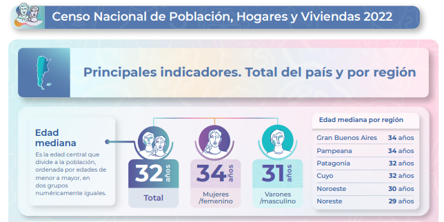
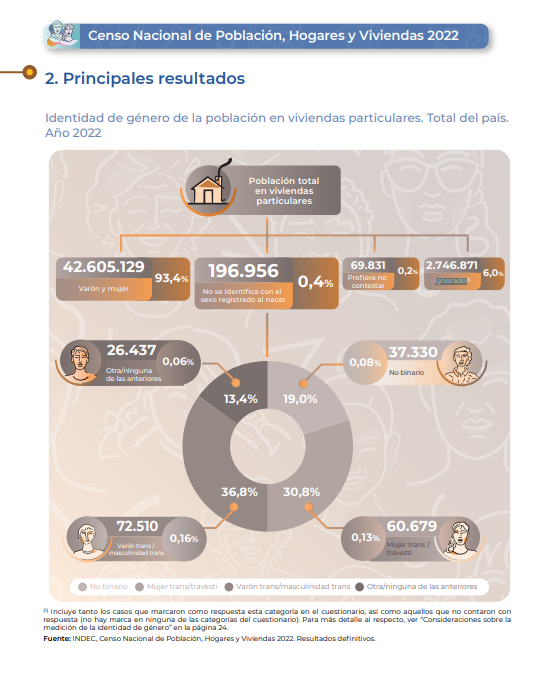
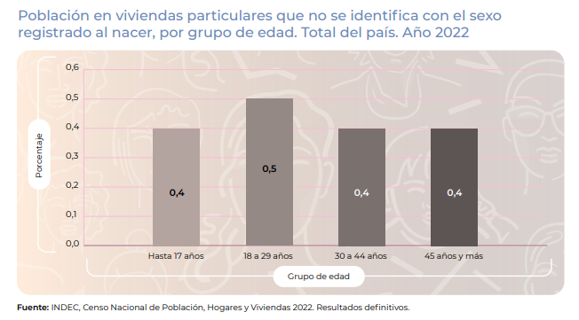

## Conocer para gestionar: por qué utilizar datos abiertos para la gestión cultural


¿Cómo podemos usar R y datos abiertos para analizar proyectos de gestión cultural?

Un aspecto fundamental a la hora de pensar en cualquier proyecto de gestión cultural es conocer a nuestros interlocutores, de modo que se pueda re-diseñar e ir ajustando los objetivos del proyecto de acuerdo a los diferentes targets.

**R puede ser un gran aliado en esta tarea ayudándonos a visualizar y comprender la información que tengamos disponible y es por ello que en este post nos proponemos compartir algunas ideas de cómo hacerlo explorando diferentes librerías y recursos.**

Los **datos públicos abiertos** en este contexto son una primera herramienta fundamental, no solo desde el punto de vista de la transparencia en la gestión sino como herramienta para los gestores culturales, interesados en diferentes industrias culturales.

En marzo de 2021 el Ministerio de Cultura de la Nación creó un sistema de ventanilla única para la inscripción y gestión para sus convocatorias llamado Registro Federal de Cultura (RFC). De esta manera personas residentes en Argentina podían postularse de manera directa a becas, concursos y subsidios a través de la plataforma en línea. Los datos de estos postulantes fueron disponibilizados en el [portal de datos abiertos del Ministerio de Cultura de la Nación](https://datos.cultura.gob.ar/) permitiéndonos explorar y conocer quienes fueron los interlocutores de esta cartera en entre 2021 y 2023.

Asimismo a partir de Noviembre de 2023 el Instituto Nacional de Estadística y Censos publicó una serie de informes los [resultados definitivos del Censo Poblacional 2022](https://censo.gob.ar/index.php/datos_definitivos/). Gracias a que el diseño del Registro Federal de Cultura retoma algunas de las preguntas realizadas en el Cneso (ya que son contemporáneos en su proceso de formulación), nos facilita la comparabilidad entre la muestra (el Registro) y la población general.

En este post el indicador de identidad de género en función de dos líneas de trabajo centrales del RFC como el federalismo y trabajo cultural, y así poder observar si existen diferencias entre parámetros poblacionales y aquellos que logró el RFC como herramienta de comunicación con su comunidad.

::: callout-warning
## Advertencia

Es importante entender que debido a las temporalidades y formas de recolección el RFC no representativo de todo el universo de interlocutores del Ministerio de Cultura ya que existen convocatorias y áreas que quedan por fuera de esta ventanilla única como museos, institutos y entidades autárquicas, cuyas convocatorias se realizan a través de otros canales directos con estas instituciones que preceden a la creación del Ministerio de Cultura.

Por sus características el RFC tampoco es representativo del universo de actores culturales de argentina sino solo de aquellos
:::

## Preparando nuestra caja de herramientas

Comenzamos por cargar las librerías que estaremos usando a lo largo de nuestro trabajo.

Las librerías que estaremos usando son:

tidyverse: para la manipulación de datos janitor: para el orden y limpieza de las tablas gt: para creación de tablas html gtExtras: una extensión de para gt leaflet: para creación de mapas

Y las extensiones de ggplot elementalist: un paquete en su fase experimental ggtext: para agregar texto en ggplot

```{r, echo=FALSE, warning=FALSE, message=FALSE}
library(tidyverse)  # Manipulación de datos
library(janitor) # Orden y limpieza
library(gt) # Tablas 
library(gtExtras) # Extras para las tablas gt
library(leaflet) # Mapas
library(plotly) #Gráficos dinámicos
# Extensiones de ggplot
library(elementalist) # devtools::install_github("teunbrand/elementalist") # redondear bordes en los fondos
library(ggtext)
library(sf)
library(tmap)

```

Bajamos la base del RFC del portal de Datos abiertos.

```{r}
rfc <- read.csv("https://datos.cultura.gob.ar/dataset/d47cf8e9-e338-4e8e-ba30-09d3e11f26f1/resource/054e7cfb-9add-4a46-a68b-ef0bd26df391/download/rfc_personas_datos_abiertos.csv", encoding = "latin1")

```

Para arrancar le damos un vistazo inicial a los datos

```{r}

glimpse(rfc)

```

En el periodo 2021-2023 el Ministerio vemos que interactuó con más de **150 mil personas** a lo largo y ancho del país. También vemos que nos proporciona 18 variables con información sobre el lugar de residencia, sexo, pertenencia a minorías étnicas (afro e indigena), así como áreas de participación cultural y el rol que cumple la persona dentro de ese área, entre otras.

## Transformaciones

Antes de iniciar el análisis hacemos algunas transformaciones y creamos variables auxiliares que nos permitirán trabajar con los datos:

-   Regionalización: unimos las provincias en regiones según lugar de residencia de las personas.

-   Codificamos los nombres de las provincias para su mapeo en una coropleta de acuerdo a la variable in1 que propone el Instituto Geográfico Nacional en sus bases de goedesia con límites provinciales.

-   Edad: calculamos en función de la fecha de nacimiento.

-   Género: agrupamos el género de acuerdo a las categorías de análisis propuestas en Censo poblacional 2022 en su informe.

-   Core de trabajadores culturales: identificamos el segmento de personas que percibían ingresos en 70% de su actividad cultural al momento de su inscripción.

```{r}

# Creaamos unos vectores auxiliares para las regiones.

# Regiones
NOA <- c('CATAMARCA','JUJUY','LA RIOJA','SALTA','SANTIAGO DEL ESTERO','TUCUMAN')
NEA <- c('CORRIENTES', 'FORMOSA','CHACO','MISIONES')
CUYO <- c('MENDOZA','SAN LUIS', 'SAN JUAN')
PATAGONIA <- c('RIO NEGRO','NEUQUEN','CHUBUT','SANTA CRUZ','TIERRA DEL FUEGO','LA PAMPA')
CENTRO <- c('CORDOBA','ENTRE RIOS', 'SANTA FE')


rfc <- rfc |>  
  mutate(
    fecha_nacimiento_como_fecha = as.Date(fecha_nacimiento,"%Y-%m-%d"),
    fecha_nacimiento_como_fecha = 
      if_else(is.na(fecha_nacimiento_como_fecha),as.Date(fecha_nacimiento,"%d/%m/%Y"),fecha_nacimiento_como_fecha),
    edad_exacta = year(today()) - year(fecha_nacimiento_como_fecha),
    cisgenero = case_when(
        identidad_de_genero %in% c("Mujer","Varón")  ~ "Varón y mujer",
        identidad_de_genero %in% c("Mujer trans","Varón trans","No binaria","Otras identidades")  ~ "No se identifica con el sexo registrado al nacer",
        identidad_de_genero == "Prefiero no decirlo"  ~ "Prefiere no contestar",
        NA ~ "Ignorado"),
    region = case_when(
            provincia_de_residencia == 'Capital Federal (C.A.B.A.)' ~ "C.A.B.A",
            provincia_de_residencia %in% 'BUENOS AIRES' ~ "BS.AS.",
            provincia_de_residencia %in% CENTRO ~ "Centro",
            provincia_de_residencia %in% CUYO ~ "Cuyo",
            provincia_de_residencia %in% NEA ~ "NEA",
            provincia_de_residencia %in% NOA ~ "NOA",
            provincia_de_residencia %in% PATAGONIA ~ "PATAGONIA",
            TRUE ~ "Sin especificar"),
     in1 = case_when(
           provincia_de_residencia == "BUENOS AIRES" ~ "06",
           provincia_de_residencia == "Capital Federal (C.A.B.A.)" ~ "02",
           provincia_de_residencia == "CATAMARCA" ~ "10",
           provincia_de_residencia == "CHACO" ~ "22",
           provincia_de_residencia == "CHUBUT" ~ "26",
           provincia_de_residencia == "CORDOBA" ~ "14",
           provincia_de_residencia == "CORRIENTES" ~ "18",
           provincia_de_residencia == "ENTRE RIOS" ~ "30",
           provincia_de_residencia == "FORMOSA" ~ "34",
           provincia_de_residencia == "JUJUY" ~ "38",
           provincia_de_residencia == "LA PAMPA" ~ "42",
           provincia_de_residencia == "LA RIOJA" ~ "46",
           provincia_de_residencia == "MENDOZA" ~ "50",
           provincia_de_residencia == "MISIONES" ~ "54",
           provincia_de_residencia == "NEUQUEN" ~ "58",
           provincia_de_residencia == "RIO NEGRO" ~ "62",
           provincia_de_residencia == "SALTA" ~ "66",
           provincia_de_residencia == "SAN JUAN" ~ "70",
           provincia_de_residencia == "SAN LUIS" ~ "74",
           provincia_de_residencia == "SANTA CRUZ" ~ "78",
           provincia_de_residencia == "SANTA FE" ~ "82",
           provincia_de_residencia == "SANTIAGO DEL ESTERO" ~ "86",
           provincia_de_residencia == "TUCUMAN" ~ "90",
           provincia_de_residencia == "TIERRA DEL FUEGO" ~ "94"),
        trabajadores_vs_otros_interlocutores = ifelse(porcentaje_de_ingresos_actividad_cultural == "Más del 70%", "Cultura es principal ingreso","Otras fuentes de ingresos"))


rm(list=setdiff(ls(), "rfc"))
```

## Análisis

Comenzamos por revisar algunas características generales como la **edad de los interlocutores**. Para ello realizaremos unos gráficos de caja o boxplot. El gráfico de cajas nos permite observar de manera rápida la distribución intercuartiles de una variable numérica (como por ej. la edad) ayudándonos rápidamente a detectar valores extremos (outliers) representados por los puntos. La caja representa el Q1 hasta el Q3, marcando el Q2 (coincidente con la mediana) en la línea sólida. Adhicionalmente hemos agregado el valor del promedio (línea punteda) que como vemos difiere de la mediana en tan solo un año. En el CENSO nacional de población la mediana fue de 32 años, mostrando un leve envejecimiento en la región de Gran Buenos Aires y Pampeana (34 años).



Como podemos ver en el gráfico de cajas el 75% de los interlocutores del MCN tiene entre 29 y 49 años con una edad promedio de 39 años y una mediana de 37 años, es decir apenas 5 años por encima de la mediana poblacional. Así mismo en el análisis por región podemos ver como los interlocutores del MCN replican los movimientos poblacionales de este indicador mostrando un leve envejecimiento en CABA y Buenos Aires (40 y 37 años) respecto de las regiones del norte del país. (NOA y NEA con 35 y 34 años).

Para realizar el gráfico escogimos la librería `plotly` que nos permite facilmente contruir gráficos interactivos. Esta es una solución interesante para trabajar con etiquetas dinámicas o hacer zoom en algún punto del gráfico en particular.

```{r}
rfc |> 
  # introducimos un tope etario de 100 años de edad
  group_by(edad_exacta) |> 
  plot_ly(y = ~edad_exacta,
          name = "",
          type = "box",
          boxmean = T) |> 
  layout(title = list(text = "<b>Edad RFC<b>",
                      font = list(weight = "bold")),
         yaxis = list(title = "Edad en años",
                      reversed = TRUE,
                      tickfont = list(weight = "bold")),
         showlegend = FALSE,
         paper_bgcolor = "#FFFFFF",
         plot_bgcolor = "#FFFFFF",
         margin = list(l = 50, r = 50, b = 50, t = 80))
  
```

```{r}
rfc |> 
  # Hacer tope en los upper y lower fences que ya se ven arriba
  filter(edad_exacta >= 7L & edad_exacta <= 100L) |> 
  select(edad_exacta, region) |> 
  plot_ly(x = ~edad_exacta, y = ~region, type = "box",
          boxmean = T,
          boxpoints = FALSE, # no mostrar los puntos
          color = ~region, # para tener una tabla de colores diferente para cada una de las regiones
          colors = c("#3ABAEB" , "#8F83BC"  ,"#50B7B0" , "#F89522",  "#FFD007",  "#D5DF33" , "#ED3F8E" )) |>  
  layout(xaxis = list(title = "Edad en años",
                      tickfont = list(weight = "bold"),
                      showgrid = FALSE),
         yaxis = list(title = "Región",
                      reversed = TRUE,
                      tickfont = list(weight = "bold")),
         title = list(text = "Edad según región",
                      font = list(weight = "bold")),
         showlegend = FALSE,
         paper_bgcolor = "#FFFFFF",
         plot_bgcolor = "#FFFFFF",
         margin = list(l = 50, r = 50, b = 50, t = 80),
         annotations = list(
           list(xref = "paper", yref = "paper", 
                x = 0, y = -0.10,
                text = "Se muestran casos entre 7 y 100 años", 
                showarrow = FALSE, #se utiliza para eliminar la flecha de la anotación
                font = list(size = 12, color = "gray", family = "Encode Sans"))))
```

Como vimos más arriba los datos abiertos del RFC nos indican la identidad de género de las personas pero no su sexo registrado al nacer, de modo que lamentablemente no podemos hacer comparativas con las pirámides poblacionales. Desde el punto de vista del análisis de la gestión como política cultural, introducir la identidad de género como variable constituyó un desafío técnico y teórico que se sustentó en la Ley 26.743 de Identidad de Género, sancionada en 2012 en la Argentina, y mediante la cual se evaluó la factibilidad de la medición de la identidad de género en el Censo 2022.

::: callout-note
## Lecturas

Para conocer más acerca de los debates técnicos que implicó este proceso el INDEC lanzó el documento "Nuevas realidades, nuevas demandas. Desafíos para la medición de la identidad de género en el Censo de Población" el cual puede leerse en línea [aquí](https://www.indec.gob.ar/ftp/cuadros/publicaciones/identidad_genero_censo_2020.pdf)
:::

El RFC retoma las categorías elaboradas por INDEC permitiéndonos realizar una comparación con el Censo Nacional.

Las personas que no se identifican con el sexo asignado al nacer casi se quintuplican entre los interlocutores del RFC (0.4% vs. 1.95%), es decir que a través de sus convocatorias el RFC logra un sesgo comunicacional positivo respecto de este segmento. Este universo de personas cisgénero del RFC tiene sin embargo una composición muy diferente a la distribución poblacional con un claro protagonismo de personas no binarias (69.14%)

::: panel-tabset
## CENSO



## RFC

```{r}
rfc |> 
  group_by(cisgenero) |> 
  summarise(N = n_distinct(id)) |>
  mutate(porcentaje_gral = round(N/nrow(rfc)*100,2)) |>
  adorn_totals() |> 
  gt() |> 
  tab_header(md("**Identificación con el sexo al nacer**")) |> 
  cols_label(cisgenero = "RFC",
             porcentaje_gral = "%") |> 
  tab_source_note("Registro Federal de Cultura")
  
```

```{r, warning=FALSE, message=FALSE}

rfc |> 
  filter(cisgenero == 'No se identifica con el sexo registrado al nacer') |> 
  group_by(identidad_de_genero) |> 
  summarise(N = n_distinct(id)) |>
  mutate(
    porcentaje_gral = round(N/nrow(rfc)*100,2),
    porcentaje_cis = round(N/sum(N)*100,2)) |> 
  gt() |> 
  tab_header(md("**Identidad de género**")) |> 
  cols_label(identidad_de_genero = "",
             porcentaje_gral = "Población",
             porcentaje_cis = "Cisgénero") |> 
  tab_footnote("Personas que no se identifican con el sexo registrado al nacer") |> 
  tab_source_note("Registro Federal de Cultura")

# tamaño del agujero de la dona
hsize <- 4

rfc |> 
  filter(cisgenero == 'No se identifica con el sexo registrado al nacer') |> 
  group_by(identidad_de_genero) |> 
  summarise(N = n_distinct(id)) |>
  mutate(
    porcentaje_gral = round(N/nrow(rfc)*100,2),
    porcentaje_cis = round(N/sum(N)*100,2)) |> 
  ggplot(aes(x = hsize, 
             y = porcentaje_cis,
             fill = identidad_de_genero)) +
  guides(fill = guide_legend(title = "Identidad de género"))+
  geom_col()+
  coord_polar(theta = "y") +
  xlim(c(0.2, hsize + 0.5))+
  geom_label(
    aes(label = paste(porcentaje_cis,"%")),
    position = position_stack(vjust = 0.5),
    color = "white",
    show.legend = FALSE)+
  hrbrthemes::scale_fill_ipsum()+
  theme(legend.position = "right",
        text = element_text(family='sans', color='black'),
        panel.background = element_rect(fill = "white"),
        panel.grid = element_blank(),
        axis.title = element_blank(),
        axis.ticks = element_blank(),
        axis.text = element_blank(), 
        ) +
  scale_fill_manual(values = c("#9284be","#ffce00", "#b4beba","#ef5350")) 
  
  
```

```{r,include=FALSE}
rm(hsize)
```
:::

### Nuevas identidades

Asimismo y siguiendo el análisis de este segmento de persona cisgénero, el RFC obtiene una mayor interacción con el grupo de 30 a 44 años, esto plantea una diferencia importante respecto de la distribución etarea poblacional de este grupo donde a nivel poblacional la edad muestra una distribución más homogénea.

::: panel-tabset
#### CENSO



#### RFC

```{r, warning=FALSE, message=FALSE}

rfc |> 
# Replicamos los tramos etáreos
    mutate(edad_grupos = 
           factor(case_when(
             edad_exacta <18 ~ "Hasta 17 años", 
             edad_exacta <30 ~ "18 a 29 años",
             edad_exacta <45 ~ "30 a 44 años",
             edad_exacta >44 ~ "45 años y más"),
            levels = c("Hasta 17 años","18 a 29 años","30 a 44 años","45 años y más"),
            ordered = T)
         ) |> 
  group_by(edad_grupos,cisgenero) |> 
  summarise(N = n_distinct(id)) |>
  mutate(porcentaje_gral = round(N/nrow(rfc)*100,2)) |> 
  filter(cisgenero == "No se identifica con el sexo registrado al nacer") |> 
  select(-c(cisgenero,N)) |> 
# Creamos un gráfico
ggplot(aes(
  x = edad_grupos,
  y = porcentaje_gral,
  fill = edad_grupos)
  ) + 
  geom_col(fill = c("#B3A4A0","#958986","#7A706E","#5D5554"), color = "#bfb8d6") +
  labs(x = "Grupos de edad",
       y = "Porcentaje sobre la población general",
       title = "Interlocutores RFC que no se identifica con el sexo registrado\nal nacer según grupo de edad") +
  # Etiquetas de valor
  geom_text(
    aes(label = porcentaje_gral),
    colour="white",
    position = position_stack(vjust = 0.5),
    fontface = "bold"
    )+
  # theme base 
  ggthemes::theme_clean()+
  # especificaciones de theme 
  theme(
    # Color y tamaño del título
    plot.title = element_text(
      colour='#2897d4', 
      face = "plain",
      size= 18,
      margin = margin(0, 0, 20, 0)),
    plot.title.position = "plot",
    # Color y tipo de líneas
    panel.grid.major.y = element_line(
      colour = "#9284be", 
      linetype = "dashed"),
    # Redondeo de fondo de panel del gráfico
    panel.background  = elementalist::element_rect_round(
      fill = "#bfb8d6", 
      color = "#bfb8d6"), 
    # Cajas alrededor de los títulos de los ejes x e y con bordes redondeados
    axis.title.x = 
      ggtext::element_textbox(
        linetype = 1,r = grid::unit(10, "pt"),
        padding = margin(5, 10, 5, 10),
        margin = ggplot2::margin(10, 0, 0, 0),"cm"),
    axis.title.y = 
      ggtext::element_textbox(
        linetype = 1,
        r = grid::unit(10, "pt"),
        padding = margin(5, 10, 5, 10), 
        margin = ggplot2::margin(0, 0, 10, 0),
        orientation = "left-rotated")
  )
```
:::

¿Qué sucede desde el punto de vista del federalismo respecto de esta población? En este punto vemos que los interlocutores cisgénero del RFC se distribuyen con un sesgo más federal respecto de los valores poblacionales del CENSO. Si bien la Ciudad de Buenos Aires, provincia de Buenos Aires, Córdoba, Santa fe y Mendoza, siguen atrayendo la mayor cantidad de interlocutores se observan diferencias superiores a los 5 puntos porcentuales sobre todo en la capital del país.

```{r}
cisgenero_provincia_censo <- readxl::read_xlsx("c2022_tp_genero_c1.xlsx")|> 
  mutate(percent = round(percent*100,2))

rfc |> 
  filter(cisgenero == "No se identifica con el sexo registrado al nacer") |> 
  tabyl(in1) |> 
  mutate(percent = round(percent*100,2)) |> 
  left_join(cisgenero_provincia_censo,by = "in1",suffix = (suffix = c("_RFC", "_CENSO"))) |> 
  select(provincia,percent_RFC,percent_CENSO) |> 
  mutate("Diferencia en pp" = percent_CENSO-percent_RFC) |> 
  gt() |>
  cols_label(provincia = "Provincia",
             percent_RFC = "RFC",
             percent_CENSO = "CENSO") |> 
  tab_header(md("**Personas que no se identifican con el sexo <br> registrado al nacer según provincia de residencia**")) 
```

```{r, echo=FALSE, warning=FALSE, message=FALSE}
# Traer info del Censo
cisgenero_provincia_censo <-  readxl::read_xlsx("c2022_tp_genero_c1.xlsx") |>
  mutate(percent = round(percent*100,2))

# Unir a datos el RFC
datos_mapa <- rfc |>
  filter(cisgenero == "No se identifica con el sexo registrado al nacer") |>
  tabyl(in1) |>
  mutate(percent = round(percent*100,2)) |>
  left_join(cisgenero_provincia_censo,by = "in1",suffix = (suffix = c("_RFC", "_CENSO"))) |>
  mutate("Diferencia en pp" = percent_CENSO-percent_RFC)  |>
  relocate(provincia, .after = in1)

# Importar coordenadas geo
provincias <- read_rds("mapa_argentina_continental.rds") 

# Unir las coordenadas a los datos
datos_mapa <- left_join(provincias,datos_mapa, by = c("NAME_1" = "provincia") )


# Definir puntos de corte, etiquetas y paleta de colores
bins <- c(0,5,10,15,20,25,30,35,40)
pal <- leaflet::colorBin("YlOrRd", domain = datos_mapa$percent_CENSO, bins = bins)

label_CENSO <- sprintf(
   "<strong>%s</strong><br/><strong>%s%%</strong><br/>%g personas",
  datos_mapa$NAME_1,datos_mapa$percent_CENSO, datos_mapa$n_CENSO
) |>  lapply(htmltools::HTML)

label_RFC <- sprintf(
   "<strong>%s</strong><br/><strong>%s%%</strong><br/>%g personas",
  datos_mapa$NAME_1,datos_mapa$percent_RFC, datos_mapa$n_RFC
) |>  lapply(htmltools::HTML)


```

```{r, warning=FALSE, message=FALSE}
#| layout: [[1,1]]

leaflet(datos_mapa) |> 
  setView(-60,-40, zoom = 4) |>  
  addProviderTiles("MapBox", options = providerTileOptions(
    id = "mapbox.light",
    accessToken = Sys.getenv('MAPBOX_ACCESS_TOKEN'))) |> 
  addPolygons(
    fillColor = ~pal(percent_CENSO),
    weight = 2,
    opacity = 1,
    color = "white",
    dashArray = "3",
    fillOpacity = 0.7,
    highlightOptions = highlightOptions(
      weight = 5,
      color = "#666",
      dashArray = "",
      fillOpacity = 0.7,
      bringToFront = TRUE),
    label = label_CENSO,
    labelOptions = labelOptions(
      style = list("font-weight" = "normal", padding = "3px 8px"),
      textsize = "15px",
      direction = "auto")) |> 
  addLegend(pal = pal, 
            values = ~percent_CENSO, 
            opacity = 0.7, 
            title = "CENSO",
    position = "bottomright")

leaflet(datos_mapa) |> 
  setView(-60,-40, zoom = 4) |>  
  addProviderTiles("MapBox", options = providerTileOptions(
    id = "mapbox.light",
    accessToken = Sys.getenv('MAPBOX_ACCESS_TOKEN'))) |> 
  addPolygons(
    fillColor = ~pal(percent_RFC),
    weight = 2,
    opacity = 1,
    color = "white",
    dashArray = "3",
    fillOpacity = 0.7,
    highlightOptions = highlightOptions(
      weight = 5,
      color = "#666",
      dashArray = "",
      fillOpacity = 0.7,
      bringToFront = TRUE),
    label = label_RFC,
    labelOptions = labelOptions(
      style = list("font-weight" = "normal", padding = "3px 8px"),
      textsize = "15px",
      direction = "auto")) |> 
  addLegend(pal = pal, 
            values = ~percent_RFC, 
            opacity = 0.7, 
            title = "RFC",
    position = "bottomright")
```

```{r, include=FALSE}
rm(list=setdiff(ls(), "rfc"))
```

## Economía de la Cultura e identidad de género

Otro de los ejes centrales para el MCN en el diseño de sus políticas culturales era la perspectiva de la economía de la cultura y sobre todo del empleo en áreas vinculadas a los sectores creativos.

Si bien esta línea de trabajo posee una mayor complejidad que puede relavarse a través de otras fuentes y estudios, como la [cuenta satélite de cultura](https://www.sinca.gob.ar/CuentaSatelite.aspx), el RFC nos brinda una primera aproximación a esta cuestión a través de la variable `porcentaje_de_ingresos_actividad_cultural` la cual nos permitiría identificar entre sus interlocutores a aquellos que tienen como principal fuente de ingresos una actividad económica vinculada a la cultura.

Para visualizar este punto en nuestra sección de transformación de variables creamos la variable `trabajadores_vs_otros_interlocutores` que agrupa a aquellas personas que responden que su `porcentaje_de_ingresos_actividad_cultural` se encuentra por encima del 70% de las que no.

**Solo el 20% de los interlocutores relevados en el RFC percibe más del 70% de sus ingresos de una actividad cultural** de modo el 80% restante debe complementarla con ingresos de otras fuentes que no son propias del sector.

```{r, warning=FALSE, message=FALSE}
rfc |> 
  group_by(trabajadores_vs_otros_interlocutores) |> 
  summarise(N = n_distinct(id)) |>
  mutate(
    porcentaje_gral = round(N/nrow(rfc)*100,2)) |> 
  ggplot(aes(x = 4, 
             y = porcentaje_gral,
             fill = trabajadores_vs_otros_interlocutores)) +
  guides(fill = guide_legend(title = "Trabajadores vs otros interlocutores"))+
  geom_col()+
  coord_polar(theta = "y") +
  xlim(c(0.2, 4 + 0.5))+
  geom_label(
    aes(label = paste(porcentaje_gral,"%\n",N,"Personas")),
    position = position_stack(vjust = 0.5),
    color = "white",
    show.legend = FALSE)+
  hrbrthemes::scale_fill_ipsum()+
  scale_fill_manual(values = c("#6ea100","#ef5350"))+
  theme(legend.position = "right",
        text = element_text(family='sans', color='black'),
        panel.background = element_rect(fill = "white"),
        panel.grid = element_blank(),
        axis.title = element_blank(),
        axis.ticks = element_blank(),
        axis.text = element_blank(), 
        ) 


```

Para poner en contexto este dato tomamos la [Encuesta Nacional de Consumos Culturales 2022](https://datos.gob.ar/dataset/cultura-encuesta-nacional-consumos-culturales/archivo/cultura_18ccc305-eada-44e7-a06a-5877ec83e0b8), la cual posee representatividad de la población de 13 y más años, residente en hogares particulares en aglomerados urbanos de más de 30.000 habitantes. Allí se consultaba a los entrevistados si trabajaban en el sector cultural o se dedica a alguna actividad cultural/artística de forma profesional, valor que como podemos observar en la siguiente tabla es del 3.17%.

```{r, warning=FALSE, message=FALSE}
encc <- read.csv("https://datos.cultura.gob.ar/dataset/251c2ac2-e670-451c-9dbf-a4212af225b5/resource/b635d1fc-2161-4901-a21d-7f93d56d99a4/download/base-datos-encc-2022-2023.csv") |> 
  select(id,region,genero,edad,ponderador,forma3,forma4)

encc |>
  group_by(forma3) |> 
  summarise(Suma = round(sum(ponderador))) |> 
  mutate(Porcentajes = paste(round(Suma/sum(Suma)*100,2),'%')) |> 
  gt() |> 
  tab_header(md("<b>Trabajaba en el sector cultural o se dedica a <br> alguna actividad cultural/artística de forma profesional<b>"),
             subtitle = "Personas de la ENCC") |> 
  cols_label(forma3 = "") |> 
  tab_source_note("Encuesta Nacional de Consumos Culturales 2022") |> 
  tab_footnote(paste("Datos ponderados para", nrow(encc), "casos efectivos"))
  


```

Dado este `n` tan reducido exploramos una apertura simple por identidad de género, y si bien las muestras no son estrictamente comparables podemos observar que el RFC logra una **convocatoria más equilibrada** respecto del parámetro que arroja la ENCC en el cual las mujeres superan por 10 puyntos porcentuales el parámetro observado en la ENCC.

```{r, warning=FALSE, message=FALSE}
encc_trabajadores_genero <- encc |>
  filter(forma3 == "SI") |> 
  group_by(genero) |> 
  summarise(n = round(sum(ponderador))) |> 
  mutate(percent = paste(round(n/sum(n)*100,2),'%')) 


rfc |> 
  filter(trabajadores_vs_otros_interlocutores == "Cultura es principal ingreso") |> 
  tabyl(identidad_de_genero) |> 
  adorn_pct_formatting(digits = 2) |> 
  as.data.frame() |> 
  rename("genero" = identidad_de_genero) |> 
  left_join(encc_trabajadores_genero, 
            by = "genero", 
            suffix  = c ("_RFC", "_ENCC")) |> 
  gt() |> 
  tab_header(md("<b>Identidad de género trabajadores culturales<b>")) |> 
  gt::tab_spanner(label = "RFC", 
                  columns = ends_with("_RFC")) |> 
  gt::tab_spanner(label = "ENCC", 
                  columns = ends_with("_ENCC")) |> 
  cols_label(genero = "Género",
             n_RFC = "N",
             percent_RFC = "%",
             n_ENCC = "N",
             percent_ENCC = "%") |> 
  tab_footnote(locations = cells_column_spanners("RFC"),
               "Personas del RFC cuyo porcentaje de ingresos de actividad cultural es al menos 70%") |> 
  tab_footnote(locations = cells_column_spanners("ENCC"),
               "Personas ENCC que trabajaban en el sector cultural o se dedica a alguna actividad cultural/artística de forma profesional")
```

```{r, include=FALSE}
rm(list=setdiff(ls(), "rfc"))
```

Sin embargo este comportamiento no es similar dentro de todas las áreas culturales que el RFC tiene como interlocutores. En el siguiente gráfico podemos ver que dentro de este segmento de Personas del RFC cuyo porcentaje de ingresos de actividad cultural es al menos 70% (30.947 personas), hay áreas más feminizadas, (como Patrimonio, Diseño, Artesanías y Artes visuales), mientras que otras vinculadas a la Música, oficios técnicos y artes electrónicas.

```{r, warning=FALSE, message=FALSE}
rfc |> 
  filter(trabajadores_vs_otros_interlocutores == "Cultura es principal ingreso") |> 
  mutate(identidad_de_genero_2 = 
           factor(case_when(
             identidad_de_genero %in% c("Mujer trans","No binaria","Otras identidades","Varón trans") ~ "Otras",
             identidad_de_genero == "Prefiero no decirlo" ~ "Prefiero no decirlo",
             TRUE ~ identidad_de_genero),
             levels = c("Mujer","Varón","Otras","Prefiero no decirlo"),
             ordered = T)) |> 
  group_by(area_principal,identidad_de_genero_2 ) |> 
  summarise(n = n_distinct(id)) |> 
  mutate(porcentaje = n/sum(n)*100) |>
  mutate(porcentaje_mujer = porcentaje[identidad_de_genero_2 == "Mujer"]) %>%
  arrange(desc(porcentaje_mujer)) %>%
  plot_ly(x = ~porcentaje, 
          y = ~fct_reorder(area_principal, porcentaje_mujer), # reordena el eje y en función del valor del porcentaje de mujeres en el sector
          type = 'bar', 
          name = ~identidad_de_genero_2,
          color = ~identidad_de_genero_2,
          colors = c("#9284be","#2cb9ee","#6ea100","#ffce00")) |> 
  layout(yaxis = list(title = ''),
         xaxis = list(title = 'Porcentaje'),
         barmode = 'stack',
         title = list(text = "<b>Area de trabajo<b>",
                      font = list(weight = "bold")),
         margin=list( t = 50,  pad = 4)) 
  
    

```

## Algunas conclusiones

En este breve post pudimos ver cómo R funciona como herramienta para visualizar y explorar datos abiertos para la gestión cultural.

Volviendo a nuestra pregunta inicial acerca del Registro Federal de Cultura como herramienta de interacción para las políticas públicas en función de las variables de identidad de género, pudimos ver un sesgo de discriminación positiva respecto de los valores poblacionales del CENSO para las identidades cisgénero.

Este sesgo también se reitera de manera positiva a favor de las mujeres para entre las personas que tienen como principal fuente de ingresos la cultura, al compararlo con los valores relevados por la Encuesta Nacional de consumos culturales.
