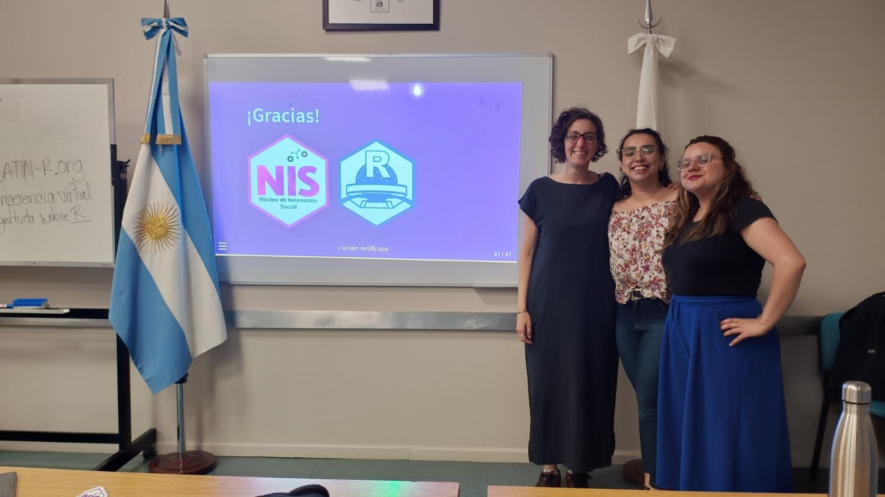
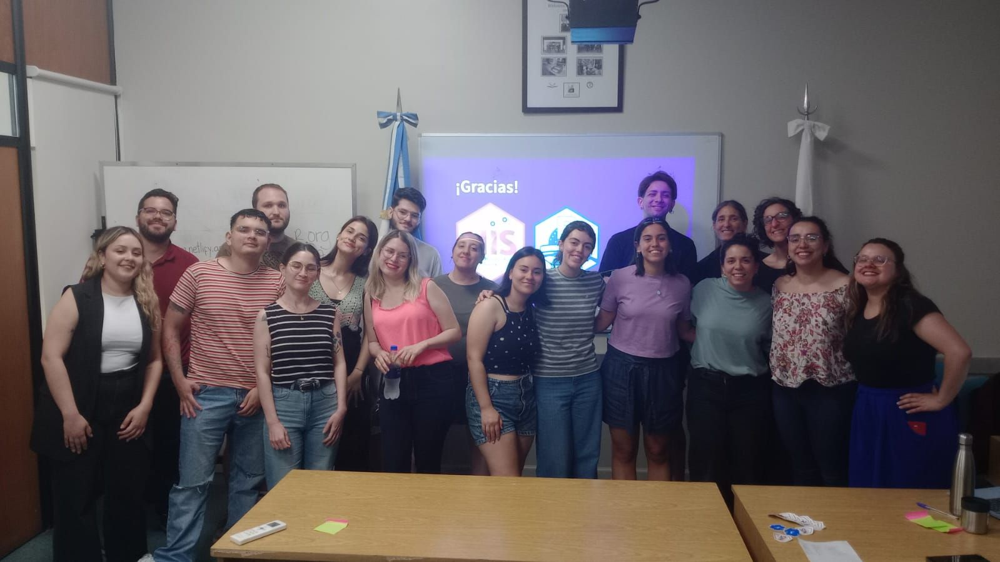

## R para demografía social

{fig-align="center"}

Junto a Andrea Gomez Vargas y Ariana Bardauil llevamos adelante el taller "R para demografía social".

En conjunto con R en Buenos Aires y con el acompañamiento de la cátedra de Demografía social de Ciencias Políticas de la Universidad Nacional de La Matanza integramos conocimientos de las ciencias sociales y su aplicación a una fuente central para la investigación como la EPH de INDEC Argentina

Desde el Núcleo de Innovación Social y nos enorgullece poder integrar estos espacios donde no solo podemos poner en valor el uso de herramientas de código abierto sino también hacerlo desde la Universidad pública gratuita y de calidad.

Enlace a todo el material en <https://r-unlam.netlify.app>

{fig-align="center"}
