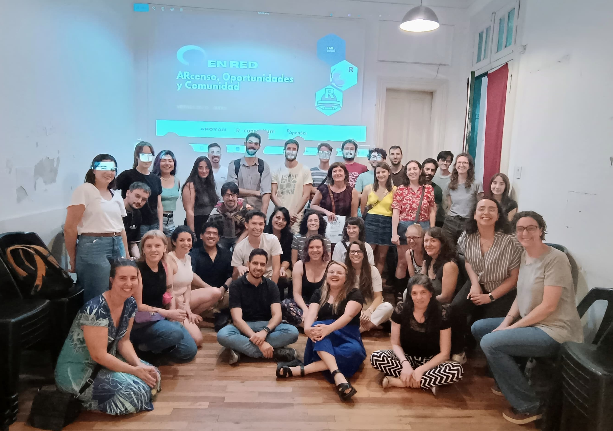

## R en Red Experiencias y Oportunidades de Networking

{fig-align="center"}

Como organizadora del NIS tuve la oportunidad de participar de la charla organizada por [R-Ladies Buenos Aires](https://rladiesba.netlify.app/) en colaboración con [R en Buenos Aires](https://renbaires.github.io/). Junto con [María Nanton](https://www.linkedin.com/in/mar%C3%ADa-cristina-n-920170126/) y [Jesi Formoso](https://www.linkedin.com/in/jesica-formoso-16ab4649/), compartimos experiencias y espacios de trabajo en los que estamos involucradas, mostrando cómo estos no solo generan oportunidades de formación, sino que también impulsan la construcción de comunidad.

Desde el [Núcleo de Innovación Social](https://nucleodeinnovacionsocial.com.ar/), presentamos nuestras iniciativas como equipo interdisciplinario de cientistas sociales y analistas de datos, enfocados en transformar información en conocimiento significativo. Investigamos, desarrollamos soluciones y formamos, siempre con el objetivo de empoderar organizaciones del tercer sector, universidades y sindicatos para que puedan tomar decisiones informadas y generar impacto.

Fue muy emocionante conectarse con personas de diversas áreas, desde datos censales y de salud hasta investigación académica. Hubo asistentes que recién comenzaban con R y otros con más experiencia, generando un intercambio enriquecedor.

La energía y el entusiasmo en la sala reafirmaron la importancia de crear estos espacios de encuentro. Cerramos la jornada con un brindis y networking, fortaleciendo aún más la comunidad.

Si te lo perdiste, podés ver las diapositivas aquí: [Diapositivas](https://betsycohen.github.io/r_en_red_oportunidades/#/title-slide)

Si te interesa sumarte al NIS no dudes en escribirnos a [info@nucleodeinnovacion.com](mailito:info@nucleodeinnovacion.com) o contactarnos en nuestro [Linkedin](https://www.linkedin.com/company/nucleois/?viewAsMember=true)