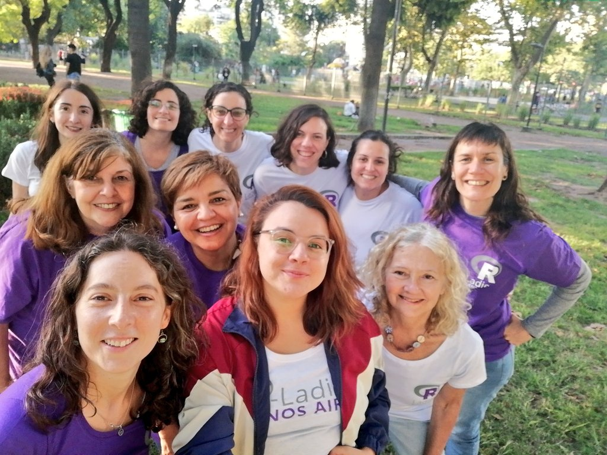

## Entrevista para R-Consortium

{fig-align="center"}

Ser organizadora de R-Ladies Buenos Aires es sin dudas una de las experiencias más enriquecedoras que he tenido y nada me honró más que poder representar a mis compañeras ante [R Consortium](https://r-consortium.org/) contando nuestra experiencia. En esta entrevista intento transmitir el crecimiento y la diversidad de la comunidad R en Argentina y su papel ante los desafíos económicos del país.

Comparto tambien algo de información sobre las actividades del grupo, incluyendo la organización de talleres sobre herramientas como Quarto y los planes para lanzar un club de lectura centrado en Shiny.

También destacó la importancia de fomentar la inclusión y la colaboración dentro de la comunidad local y en toda América Latina.

<a href="https://r-consortium.org/posts/navigating-economic-challenges-through-community-the-journey-of-r-ladies-buenos-aires/"> <button type="button" class="btn btn-primary float-end btn-sm">Leer la entrevista aquí</button></a>
