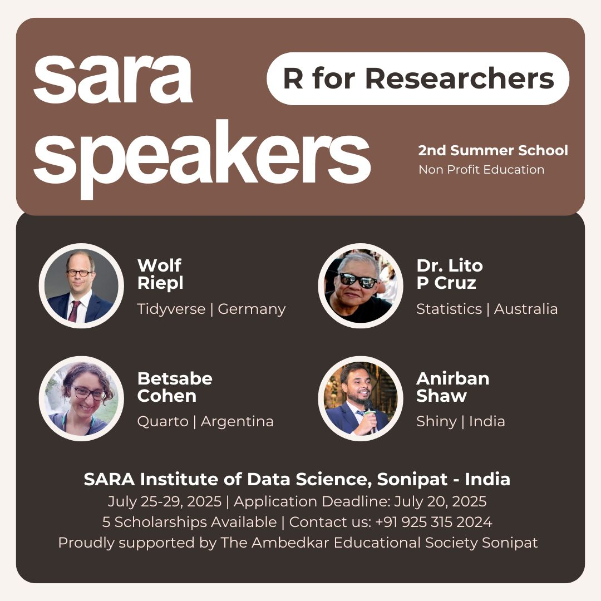

La semana pasada tuve el honor de participar como oradora invitada en la SARA Summer School “R for Researchers”, organizada por el [SARA Institute](https://sara-edu.netlify.app/). Fue la segunda edición de este encuentro, que reunió a estudiantes de maestría y doctorado de diversas disciplinas con un interés común: dar sus primeros pasos en programación y análisis de datos con R.

Mi sesión estuvo dedicada a un tema que me apasiona: la reproducibilidad en investigación. A lo largo de la charla trabajamos con Quarto, una herramienta que permite llevar nuestros análisis desde el código hasta el paper de manera transparente y colaborativa. Compartí ejemplos prácticos de cómo estructurar manuscritos académicos, integrar GitHub y, sobre todo, cultivar una práctica de investigación más abierta y sustentable.

Más allá de los aspectos técnicos, me quedo con la energía de los y las participantes: la curiosidad, las preguntas y el entusiasmo por descubrir nuevas formas de trabajo. También quiero agradecer especialmente al equipo organizador por la coordinación impecable y la calidez con la que hicieron posible este espacio.

Desde Buenos Aires hasta el resto del mundo, sigo convencida de que la reproducibilidad y el acceso abierto son claves para fortalecer la ciencia social y conectar comunidades.

🔗 Si te interesa, podés ver la presentación completa acá: [from-code-to-paper-with-quarto.netlify.app](from-code-to-paper-with-quarto.netlify.app)
