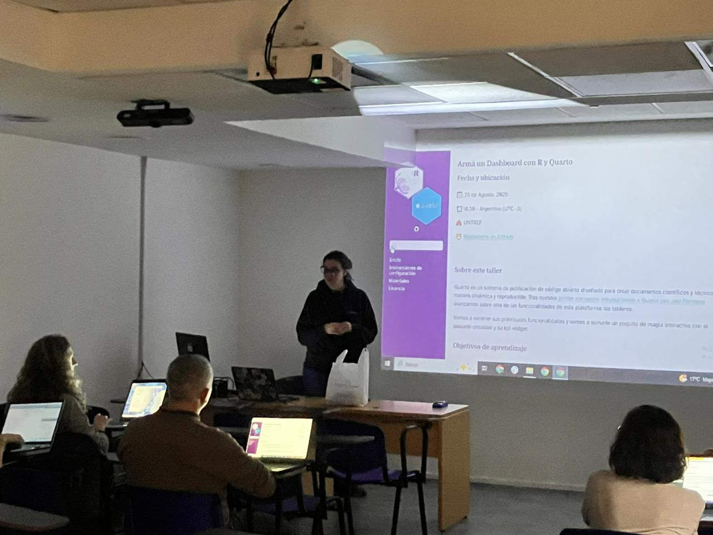

## Cómo armamos dashboards con Quarto en RLadies

{fig-align="center"}

Hace un tiempo en RLadies Buenos Aires dimos un primer paso en el mundo de Quarto con un taller introductorio de [Jesi Formoso](https://rladiesba.netlify.app/author/jesica-formoso/). Esa experiencia nos dejó con ganas de más: ¿qué pasa si además de informes reproducibles queremos crear tableros interactivos?

En agosto de 2025 nos encontramos nuevamente en la UNTREF para profundizar en esta idea. Durante el taller trabajamos con el formato dashboard de Quarto, aprendimos a organizar layouts y a integrar gráficos y tarjetas.

Lo más interesante fue sumar interactividad: con crosstalk incorporamos filtros dinámicos y con kpiwidget creamos indicadores visuales. Esto convierte a los dashboards en algo más que un reporte estático: se transforman en herramientas vivas para explorar datos y comunicar hallazgos.

Más allá de lo técnico, me gustó pensar este taller como una excusa para seguir tejiendo comunidad. Quarto no es solo una herramienta: es un puente entre quienes buscamos comunicar datos con claridad y quienes necesitan comprenderlos para decidir.

Si todavía no probaste Quarto, te recomiendo empezar por un informe sencillo. Y si ya lo conocés, animate a experimentar con los dashboards.

Más info y la presentación estan disponibles en <https://betsycohen.github.io/quarto-dashboards-rladiesBA/>
