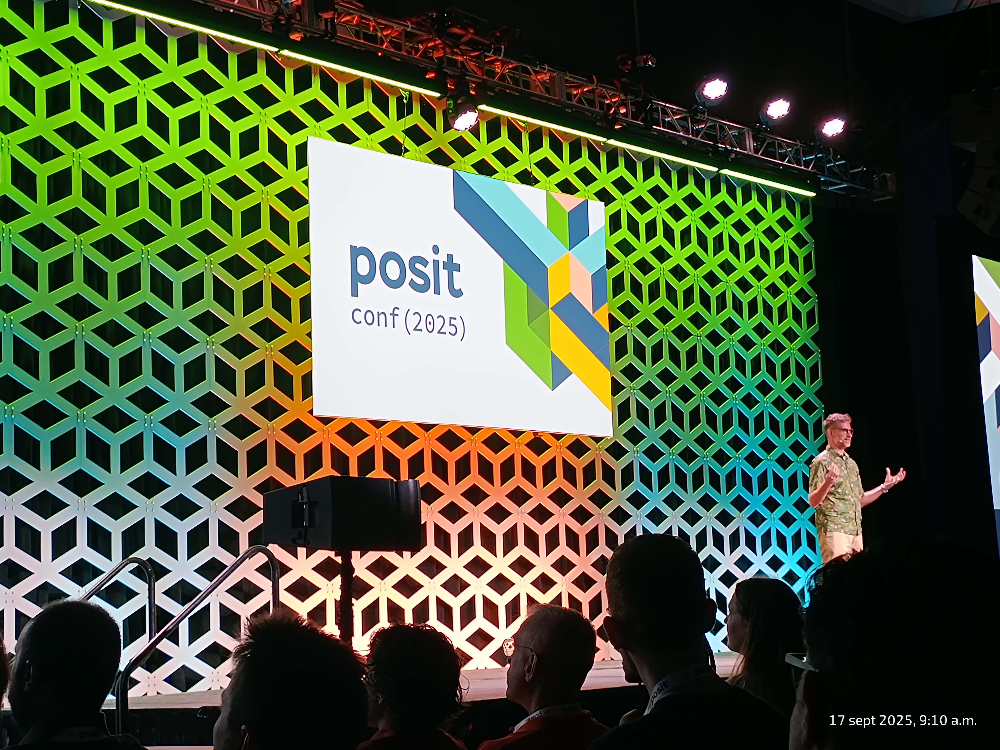
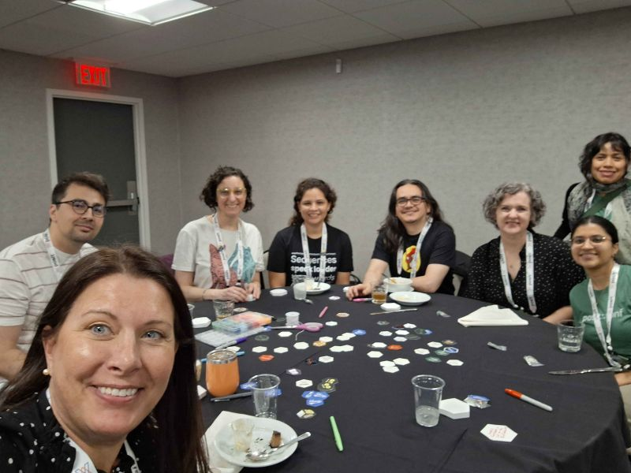
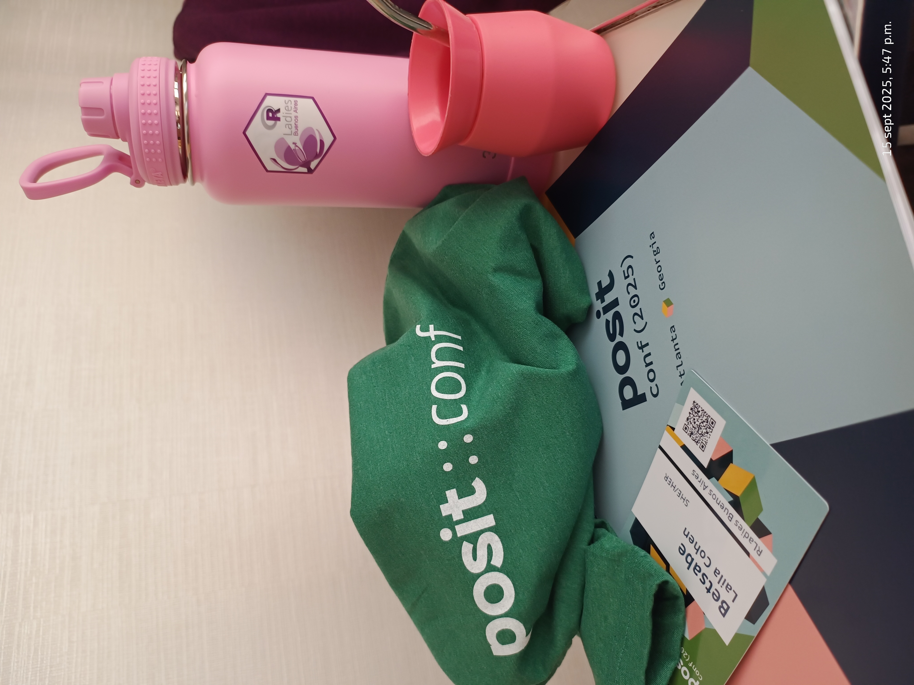
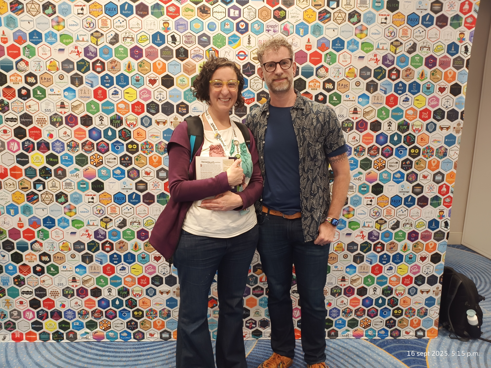
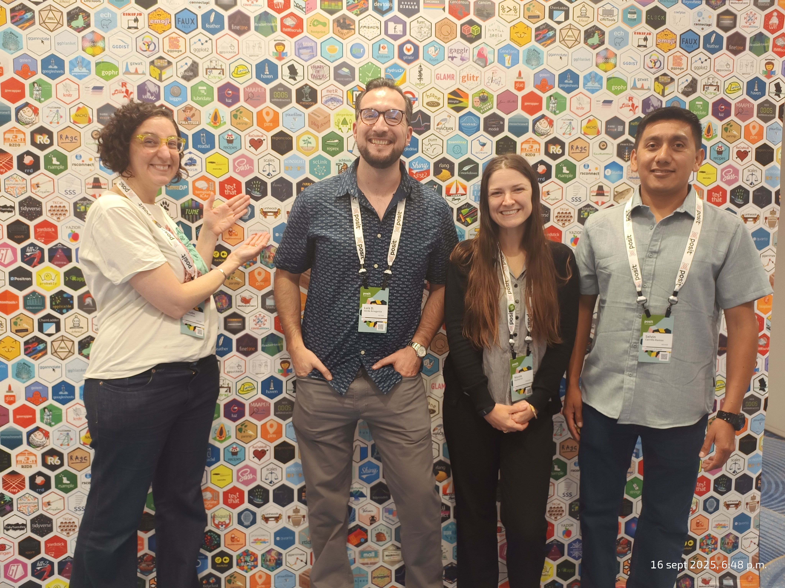
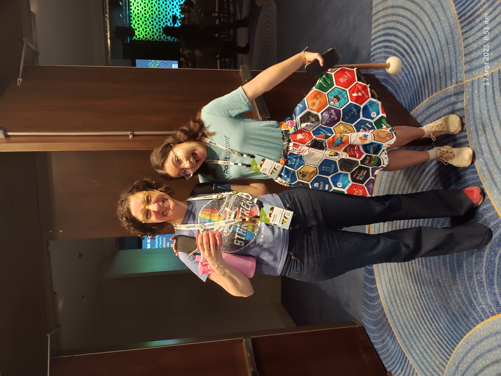
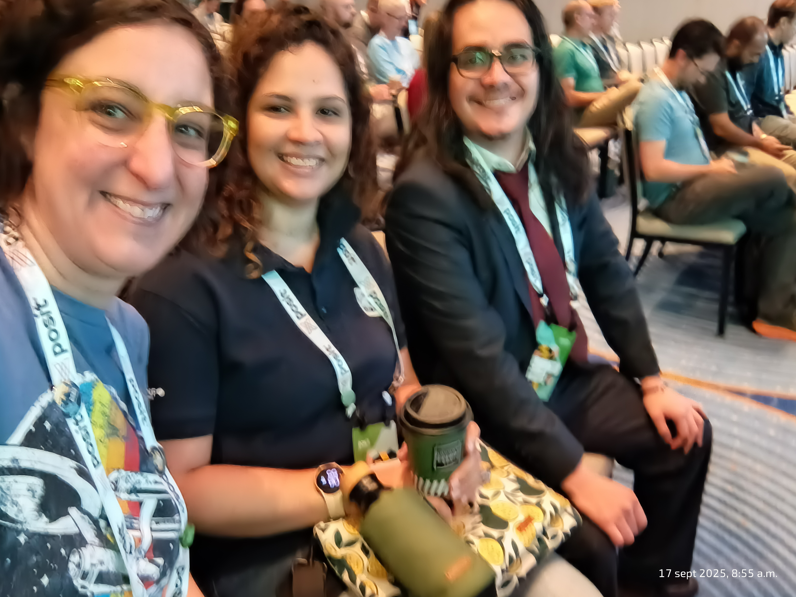

## posit::conf(2025): Notas y reflexiones desde Atlanta

Volví de **posit::conf(2025)** con mucho más que apuntes. Me traje ideas frescas, nuevas herramientas para probar y, sobre todo, la energía de una comunidad que no deja de sorprenderme por su generosidad y creatividad.

Esta fue mi primera vez en la conferencia, y quiero compartir algunos de los momentos y recursos que más me marcaron.

### Taller extending Quarto

Arranqué con el workshop **Extending Quarto** de *Mine Çetinkaya-Rundel* y *Charlotte Wickham*. Allí aprendimos a llevar Quarto más allá de los reportes tradicionales: crear extensiones, usar plantillas personalizadas e implementar filtros para automatizar transformaciones. Fue una inmersión total en cómo hacer más flexible el flujo de trabajo con documentos.\
🔗 [Materiales del workshop](https://posit-conf-2025.github.io/quarto-extend/)

La pedagogía también tuvo un lugar especial en mi agenda. Me encantó ver cómo **Claus O. Wilke** plantea la enseñanza de visualización de datos usando Quarto ([slides](https://clauswilke.com/PositConf2025/)), y cómo **Ted Laderas** combina WebR, Pyodide y Quarto para abrir nuevas posibilidades de aprendizaje interactivo ([presentación](https://laderast.github.io/degrees_of_freedom/#/title-slide)).

### Encuestas, sociología y salud pública

Uno de los momentos más resonantes para mí fue la presentación de **John Paul Helveston** con *surveydown*, una plataforma de encuestas reproducibles montada sobre Quarto + Shiny. La sociología también tiene su espacio en el universo de R, y ver esto me hizo pensar en las posibilidades para experimentar en el **NIS**.\
🔗 [surveydown.org](https://surveydown.org/)

Otra charla que me fascinó fue la de **Andrew Heiss y Gabe Osterhout**, mostrando cómo usaron R y Quarto para cubrir en vivo los resultados de las elecciones en Idaho.\
🔗 [Repositorio en GitHub](https://github.com/andrewheiss/election-desk)

Y, por supuesto, no pude dejar de pensar en mi trabajo en la **Gerencia Operativa de Gestión de Información y Estadística en Salud de la Ciudad de Buenos Aires (GOGIES)** cuando escuché experiencias ligadas a la salud pública:

-   **Becca Krouse** (GSK) presentó [{docorator}](https://github.com/GSK-Biostatistics/docorator), un paquete para simplificar la adopción de R en equipos farmacéuticos.

-   **Julianne Gent** mostró cómo usan NLP para evitar errores de facturación en sistemas de salud.

-   **Kylie Ainslie** compartió buenas prácticas para la toma de decisiones en salud pública con R ([slides](https://kylieainslie.github.io/presentations/2025/posit_conf_2025/presentation_pc2025.html#/title-slide)) e introdujo *mitey*, un paquete para problemas de epidemiología.

    Estos enfoques dialogan directamente con lo que hacemos en GOGIES, y me dejaron con muchas ideas para llevar al día a día.

### Lightning talks y joyitas inesperadas

Las charlas cortas fueron un desfile de sorpresas. Entre mis favoritas:

-   **Mauro Lepore** explicando cómo acercarse a *Positron* desde RStudio ([link](https://lnkd.in/evRu9EPk)).

-   **Ella Kay** presentando el paquete [{pregnancy}](https://ellakaye.github.io/pregnancy/) (sí, un paquete en R para seguir un embarazo)

-   **Pointblank** explicado como si fuera una receta de cocina para validar datos

-   **Gordon Woodhull** mostrando cómo gestionar *Brand YML* y modo oscuro en Quarto ([repo](https://github.com/gordonwoodhull/brand-yml-lightning-talk/blob/main/links.md)).

### Keynotes que me acompañan

Las keynotes fueron, sin duda, el corazón de la conferencia:

-   **Jonathan McPherson** mostró cómo las herramientas moldean nuestra forma de pensar y colaborar en un ejercicio sobre como las herranmientas.

-   **Hadley Wickham y Joe Cheng** pusieron a los LLMs en su justa medida: socios, no reemplazos. Presentaron iniciativas como [{ellmer}](https://clauswilke.com/PositConf2025/), [Vitals](https://www.tidyverse.org/blog/2025/06/vitals-0-1-0/), [QueryChat](https://posit-dev.github.io/querychat/r/index.html) y [ggbot2](https://github.com/tidyverse/ggbot2).

-   **Kieran Healy** cerró con un recordatorio esencial: los gráficos pueden parecer verdad, pero la confianza es algo que se construye, no se da por sentado.

### Reflexiones finales

Más allá de los paquetes, las ideas y los links, lo que me traje de posit::conf(2025) es un recordatorio simple: el trabajo con datos nunca es solo técnico, siempre es profundamente humano.

Estoy muy agradecida al programa de **Opportunity Scholars**, que hizo posible mi participación, y a **RLadies Buenos Aires** y el **Núcleo de Innovación Social** que siempre me empujan a animarme a estas aventuras y a compartir este hermoso lenguaje que es R.

{group="my-gallery"}

{group="my-gallery"}

{group="my-gallery"}

{group="my-gallery"}

{group="my-gallery"}

{group="my-gallery"}
