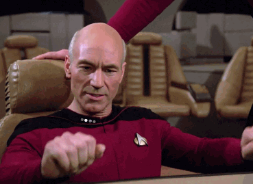

## El espacio, la frontera final

Una de las herencias más importantes que mi padre nos dejó a mis hermanos y a mi fue nuestra pasión por Star Trek. Reunidos frente al televisor, exploramos nuevas galaxias discutimos si una decisión de Jean Luke Pickard había sido correcta o quién vencería en la próxima batalla contra una raza hostil.

El paquete rtek nos permite ahora explorar una nueva frontera a donde no había llegado: RStudio. Permitiendo el acceso a el universo ficticio del fadom [Memory Alpha](https://memory-alpha.fandom.com/wiki/Portal:Main) y [Memory Beta](https://memory-beta.fandom.com/wiki/Main_Page) para recuperar datos, metadatos y otra información relacionada con Star Trek en interacción con la [Star Trek API](http://stapi.co/) (STAPI).

En este post vamos a aprovechar los datos acerca de la franquicia para

Sin más pongamos manos a la obra

{width="702"}

Una vez instalada la librería vamos a hacer una primer llamada a la API a nivel general la función `st_datasets()` nos permite ver cuáles son los datasets disponibles.

```{r}
#install.packages("rtrek")
library(rtrek)

st_datasets()
```

```{r}
st_transcripts_sample<- rtrek::st_transcripts() |> 
  slice_sample(n= 100)
```

```{r}
id <- "galaxy1"
(d <- st_tiles_data(id))
```

```{r}
stGeo
```

```{r}
id <- "galaxy2"

(d <- st_tiles_data(id))
```

```{r}
(d <- tile_coords(d, id))
```

```{r}
library(leaflet)
tiles <- st_tiles("galaxy2")
leaflet(d, options = leafletOptions(crs = leafletCRS("L.CRS.Simple"))) %>%
  addTiles(tiles) %>% setView(108, -75, 2) %>%
  addCircleMarkers(lng = ~x, lat = ~y, label = ~loc, color = "white", radius = 20)
  
```

```{r}

```
